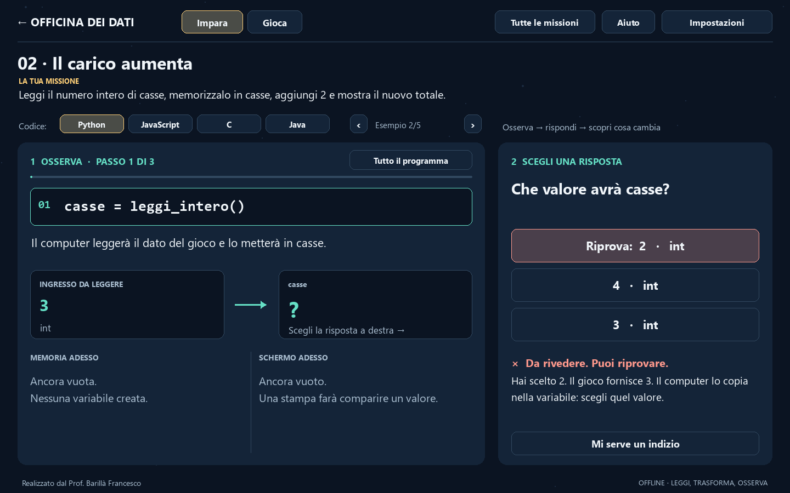
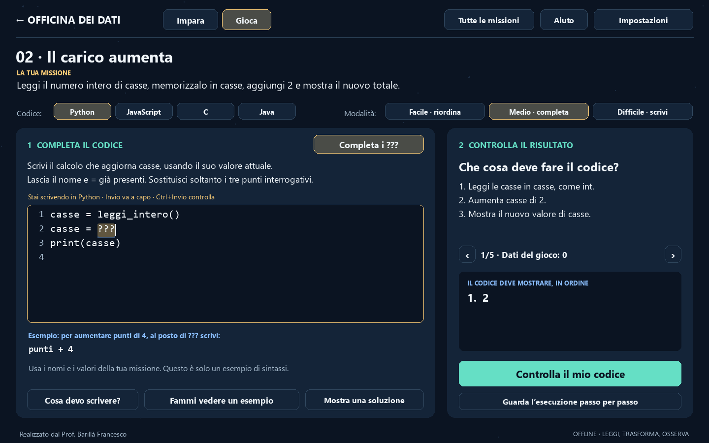
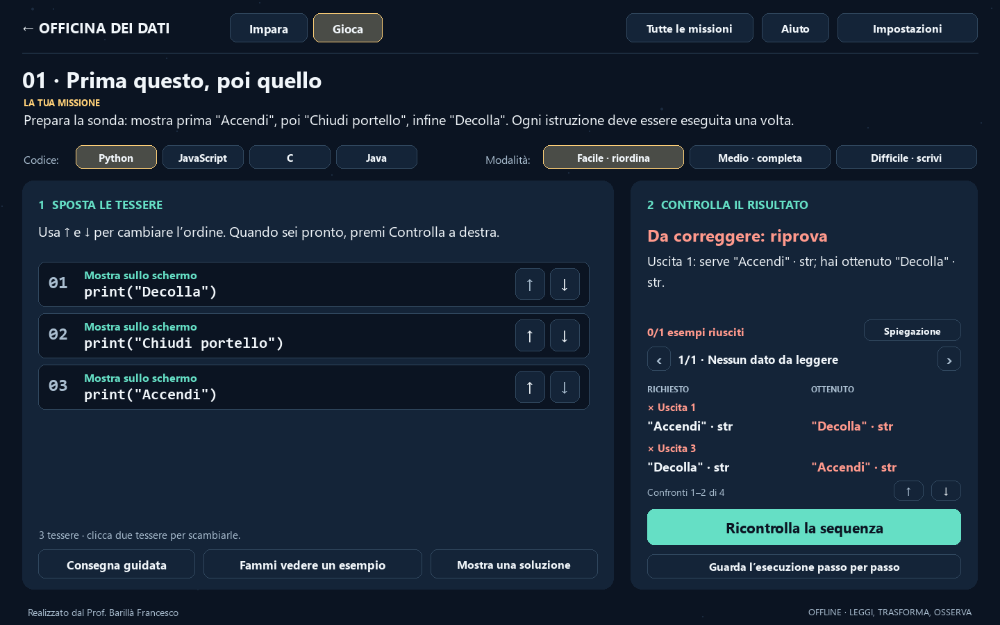

# Officina dei dati

Laboratorio offline sul **costrutto sequenziale** e sui dati **int, float,
string, bool**. Realizzato dal **Prof. Barillà Francesco**.

Ogni istruzione usa i valori lasciati dalla precedente. In **Impara** osservi
una riga, scegli una risposta e scopri cosa cambia. In **Gioca** costruisci
la sequenza e confronti il risultato richiesto con quello ottenuto.



## Avvio

Apri **OfficinaDati.exe**, oppure **Avvia_Officina.cmd**, nella cartella principale.
La versione Windows x64 non richiede Python, compilatori, account o connessione.
Per gli alunni distribuisci **dist/OfficinaDati-Windows.zip**: estrarre tutto
in una cartella personale prima dell'avvio.

Preferenze, bozze e progressi si salvano in `progressi_sequenza.json`, accanto
all'app. Questo file è locale e non viene incluso nei pacchetti. Il nuovo
laboratorio è nella cartella `struttura_sequenziale`, separata dagli altri.

## Impara facendo, Gioca, Scova l'equivoco

- **Impara facendo**: una riga grande a sinistra, i dati da usare e una
  domanda a destra. **Da rivedere** spiega come riprovare; **Corretto** mostra
  il nuovo valore. Premi **Ho capito · passo successivo** quando sei pronto.
  Alla fine leggi la regola e l'errore comune, poi prova la stessa missione in
  Gioca. I pulsanti **Esempio** cambiano gli ingressi. Consultare lezioni e
  soluzioni non assegna completamenti di programmazione.
- **Gioca / Facile**: sposta le tessere con le frecce accanto a ogni riga,
  oppure cliccane due per scambiarle. Rotella e **Scorri** rendono accessibili
  i programmi lunghi. Possono esistere più ordini corretti.
- **Gioca / Medio**: premi **Completa i ???** per selezionare la lacuna.
  L'indicazione distingue calcolo, testo, nome da copiare e istruzione intera.
  Scrivendo sostituisci solo la parte selezionata; il resto resta al suo posto.
- **Gioca / Difficile**: premi **Scrivi qui** e digita il programma, una
  istruzione per riga. L'editor parte vuoto; le bozze esistenti sono conservate.
  **Cosa devo scrivere?** spiega la missione con i nomi e i tipi richiesti,
  le letture e un esempio nel solo linguaggio selezionato. Un esempio di
  sintassi con altri nomi resta visibile sotto l'editor.
- **Scova l'equivoco**: seleziona una previsione, premi **Controlla** e leggi
  il riscontro. Il codice viene eseguito dopo il controllo; una nuova scelta
  richiede un nuovo controllo.

**Controlla la mia sequenza**, oppure **Controlla il mio codice** nei livelli
di scrittura, verifica tutti gli esempi della missione:
letture, variabili richieste, tipi, valori e ordine delle uscite. Se qualcosa
non corrisponde, mostra **Da correggere**, il primo caso problematico e i
valori **richiesto / ottenuto**. Gli errori nel codice evidenziano la riga.
Il risultato resta visibile finché modifichi il programma o cambi esempio.

Gli **ingressi sono forniti dal gioco**: il programma deve leggerli con i
comandi indicati. I valori attesi a destra sono ciò che il codice deve produrre.
Se scrivi solo un valore finale, lasci l'editor vuoto o mantieni dei `???`,
il controllo spiega quale azione manca. Nell'editor **Ctrl+Invio** controlla;
**Invio** inserisce una nuova riga.



**Guarda l'esecuzione passo per passo** apre una vista distinta: puoi seguire
le righe, vedere memoria e schermo e poi tornare al gioco. Osservare questa
esecuzione non assegna il completamento della missione.

Le missioni hanno da uno a cinque esempi scelti: la verifica non è una prova
su tutti i valori possibili. I decimali usano una piccola tolleranza.



Non c'è un conto alla rovescia. Le sfide sono tutte accessibili. Completamenti
e bozze sono separati per missione, difficoltà e lingua; l'ordine delle tessere
è condiviso tra le lingue. Cambiare linguaggio recupera la sua bozza, senza
tradurre automaticamente il codice scritto dallo studente.

## Banco dei tipi

Scegli un tipo e scrivi un valore: la cella di memoria e la dichiarazione
si aggiornano. Il banco usa una lingua di consultazione indipendente dalla
bozza della missione. Gli ingressi del banco accettano al massimo 40 caratteri.

Prove consigliate: `5` come intero e come stringa; `2.5` come float; `false`
come booleano e come stringa; stringa vuota e uno spazio. Nel banco stai
inserendo un valore del tipo scelto: digitare `false` nel campo bool è diverso
da convertire la stringa `"false"` con `bool()` o `Boolean()`.

| Categoria | Python | JavaScript | C11 nel laboratorio | Java |
|---|---|---|---|---|
| Interi | `int` | `number` | `int` | `int` |
| Decimali | `float` (64 bit) | `number` (64 bit) | `float` (32 bit) | `float` (32 bit) |
| Testo | `str` | `string` | `const char *` | `String` |
| Logica | `bool`, `True/False` | `boolean`, `true/false` | `bool`, da `stdbool.h` | `boolean`, `true/false` |

JavaScript non ha due tipi nativi distinti int e float: qui sono categorie
didattiche. In Python i nomi possono essere riassegnati a valori di un altro
tipo; in C e Java il tipo dichiarato resta fisso. I testi C del simulatore sono
di sola lettura. Per i letterali float di C e Java il generatore usa il suffisso
`f`. Non tutti i decimali hanno una rappresentazione binaria esatta.

## Le sedici missioni

| Missione | Concetto osservabile |
|---|---|
| Prima questo, poi quello | Ordine delle istruzioni e delle uscite |
| Il carico aumenta | int e aggiornamento con `x = x + 2` |
| Un pieno con la virgola | float e punto decimale |
| Il saluto della sonda | Stringhe, virgolette e concatenazione |
| Pronto oppure no | bool e negazione senza if |
| Un risultato logico | Memorizzare il risultato di un confronto |
| Dal conteggio alla misura | Calcolo con interi e decimali |
| Dividere senza perdere pezzi | Divisione intera, reale e conversione prima del calcolo |
| Il numero dentro il testo | Conversione esplicita prima dell'addizione |
| La temperatura media | Parentesi e precedenza degli operatori |
| Costruisci il pannello | Ordine degli ingressi e dipendenze tra variabili |
| Una fotografia del valore | Copia del valore e aggiornamenti successivi |
| Scambia le due casse | Variabile temporanea e sovrascrittura |
| Lo schermo ricorda | Le uscite precedenti non cambiano retroattivamente |
| L'ultima assegnazione | Sostituire un testo non significa concatenarlo |
| Una sonda, quattro tipi | Integrare string, int, float e bool |

## Un simulatore con un sottoinsieme esplicito

`leggi_intero()`, `leggi_decimale()`, `leggi_testo()` e `leggi_booleano()`
sono comandi didattici predisposti, non funzioni standard dei quattro linguaggi.
Consumano un ingresso alla volta nell'ordine mostrato. Si usa una lettura
per istruzione, poi si calcola sulle variabili.

Le uscite usano `print`, `console.log`, `System.out.println` oppure `mostra`
in C. `mostra`, `unisci` e `testo` sono aiuti del simulatore C; un programma C
completo richiederebbe dichiarazioni e implementazioni appropriate, oppure
funzioni standard e formati adeguati. Nell'editor si scrivono frammenti,
senza main, classi o import. Non servono compilatori installati.

Il motore interpreta assegnazioni, dichiarazioni, uscite, aritmetica elementare,
confronti singoli, negazione, AND/OR e alcune conversioni. Non esegue il codice
dello studente tramite `eval`, `exec`, shell o runtime esterni. Esclude cicli,
if, assegnazioni multiple, strutture dati, puntatori e funzioni arbitrarie.
JavaScript viene trattato in ambito rigoroso, con dichiarazioni `let` o `const`.

La divisione fra int tronca verso zero in C/Java; Python e JavaScript usano
la divisione reale. Le variabili float C/Java arrotondano a 32 bit. In Java
non si inserisce implicitamente un double in float: usa `f` o un cast. In C,
assegnare un float a int tronca; in Java la conversione va resa esplicita.
Le conversioni di testi non validi differiscono tra linguaggi: le missioni
di conversione usano stringhe numeriche valide. NaN, infiniti e aritmetica dei
puntatori non sono simulati. Un limite del simulatore non è un divieto del
linguaggio completo.

Limiti: 8000 caratteri, 80 righe, 32 istruzioni, otto variabili, testi di
200 caratteri, numeri finiti tra -10000000 e 10000000. La visualizzazione dei
float può usare meno cifre della rappresentazione interna. Le uscite mostrano
anche tipo e virgolette per distinguere testo e valori numerici: è uno schermo
didattico, non una riproduzione letterale del terminale di ogni linguaggio.

## Comandi dell'interfaccia

F11 alterna finestra e schermo intero. Esc chiude una scheda o torna indietro.
Tab e Invio navigano tra i pulsanti. Le schede lunghe si leggono con rotella,
frecce, PagSu/PagGiù e Home/End. Nell'editor: Ctrl+A/C/X/V, Ctrl+Z/Y, Tab per
quattro spazi; Shift+rotella per scorrere orizzontalmente.

Tre temi: Notte, Giorno, Contrasto. Testo del codice e delle spiegazioni
regolabile; velocità 0,5×, 1×, 2× e 3×. Aprire schede, banco o impostazioni
mette in pausa. In Impara usa **Riprendi il passaggio**; nei quiz usa **Rivedi l’esecuzione**.
I tempi dell'animazione sono didattici, non misure di prestazione.

## Sorgenti, verifiche e distribuzione

Verificato con Python 3.13.7, Pygame 2.6.1 e PyInstaller 6.20.0.

```powershell
python -m pip install -r requirements.txt
python main.py
python -m unittest discover -s tests -v
python main.py --smoke-test smoke-source.json --screenshots screenshots
python -m pip install pyinstaller==6.20.0
python build_release.py
```

La ricostruzione controlla i test, genera `OfficinaDati.exe`, verifica
l'eseguibile e crea i due ZIP. L'eseguibile resta nella radice del progetto.
Gli archivi escludono progressi personali, cache e file intermedi di build.

`engine.py` gestisce valori e istruzioni; `missions.py` le consegne e le
verifiche; `lessons.py` i contenuti; `main.py`, `experience.py`, `writing_guide.py`, `scene.py` e `ui.py` l'interfaccia;
`storage.py` i salvataggi. La proposta didattica è in `PIANO.md`.

## Riferimenti

Le differenze dei linguaggi sono confrontate con le fonti ufficiali:
[assegnazioni Python](https://docs.python.org/3/reference/simple_stmts.html#assignment-statements),
[tipi numerici ECMAScript](https://tc39.es/ecma262/multipage/ecmascript-data-types-and-values.html#sec-ecmascript-language-types-number-type),
[conversioni Java](https://docs.oracle.com/javase/specs/jls/se25/html/jls-5.html),
[C11, N1570](https://www.open-std.org/jtc1/sc22/wg14/www/docs/n1570.pdf).
Contenuti e grafica del laboratorio sono originali. Licenze dei componenti
distribuiti: `LICENZE.txt`.
